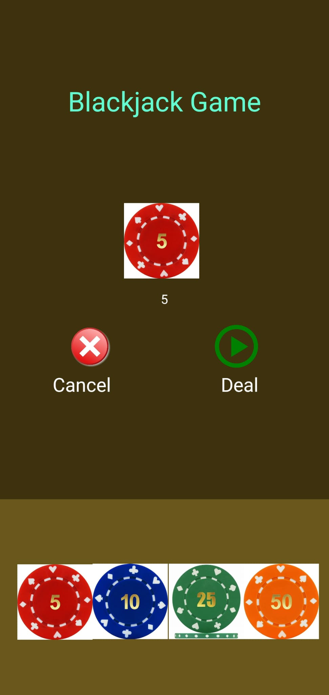
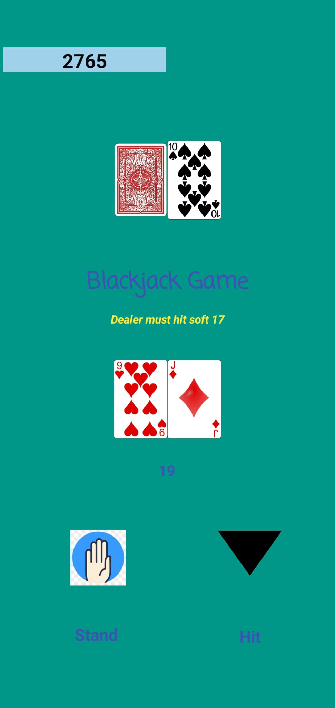
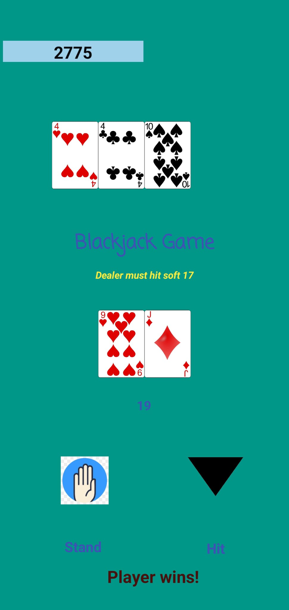
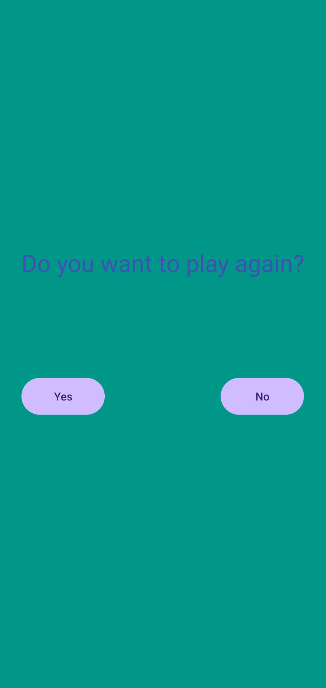

# Blackjack Game

Welcome to the Blackjack Game project! This is a simple implementation of the classic card game Blackjack, where players attempt to beat the dealer by getting a hand value as close to 21 as possible without exceeding it.
## My App UI

    
    
    
    

### Blackjack Rules
Welcome to Blackjack! Your goal is to reach a hand value close to 21 without exceeding it. Here's a quick guide:

1. **Investment:**
   - Start by betting a virtual amount.

2. **Dealing Cards:**
   - Press "Deal" to get started.
   - You and the dealer receive two cards each.

3. **Player's Move:**
   - Decide whether to "stand" or "hit" based on your cards.

4. **Dealer's Move:**
   - If you stand, dealer's face-down card is revealed.
   - If you hit, dealer's cards remain hidden.

5. **Determining the Winner:**
   - Closest to 21 wins without busting.
   - If both tied, it's a push.
     
6. **Blackjack:**
   - Ace and 10-point card is Blackjack, usually winning.

7. **Play More Rounds:**
   - Keep playing with new rounds.

8. **Exit:**
   - End the game when you're ready.

Remember, Blackjack is about strategic decisions. Good luck!

## How to Play

1. Clone the repository to your local machine using `git clone https://github.com/your-username/blackjack-game.git`.

2. Open the project in Android Studio Integrated Development Environment (IDE).

3. Run the `BlackjackGame.java` class to start the game.

4. Follow the on-screen instructions to play Blackjack. You'll be prompted to choose whether to hit or stand during your turn.

5. The game will automatically simulate the dealer's moves according to basic Blackjack rules.

6. Once the game ends, the winner (or tie) will be displayed, along with both the player's and dealer's hand values.

## Technologies Used

- Java: The game logic is implemented in Java, making use of object-oriented programming concepts.
- XML: The user interface layout and design are created using XML in Android Studio.
- Android Studio: The project is developed within the Android Studio Integrated Development Environment (IDE), providing tools for Android app development.

## Contributions

Contributions are welcome! If you'd like to improve the game, fix bugs, or add new features, follow these steps:

1. Fork the repository to your GitHub account.

2. Create a new branch for your changes: `git checkout -b feature/your-feature-name`.

3. Implement your changes and improvements.

4. Commit your changes with clear and concise commit messages: `git commit -m "Add feature: your feature description"`.

5. Push your changes to your forked repository: `git push origin feature/your-feature-name`.

6. Create a pull request on the main repository, detailing your changes and the problem they solve.

Have fun playing Blackjack and feel free to contribute to make this game even better!

